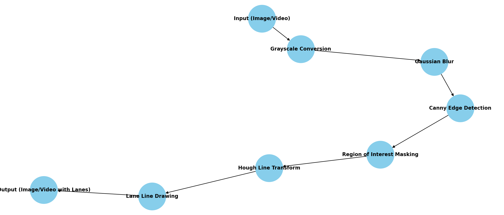

# 🛣️ Lane Detection System

This repository contains Python scripts for detecting lane lines in both images and videos using classical computer vision techniques. It provides real-time visualization of detected lanes and can be used as a foundation for self-driving car simulation, road safety projects, or CV-based vehicle assistance systems.

---

## 📁 Contents

- `lane_detector_image.py` — Detects lane lines from static images.
- `lane_detector_video.py` — Detects lanes in a video file (basic version).
- `lane_detector_video_updated.py` — Enhanced version with improvements in frame processing and visualization.
- `road_1.jpg`, `road_2.jpg`, `test_image.jpg` — Sample input images for testing.

---

## 🧠 How It Works

1. **Preprocessing**: Convert image/video frame to grayscale, apply Gaussian blur.
2. **Edge Detection**: Use Canny Edge Detector.
3. **Region of Interest (ROI)**: Mask irrelevant areas.
4. **Line Detection**: Apply Hough Transform to detect lane lines.
5. **Overlay**: Draw detected lines back on the image/video.

---
## Sequence Diagram


## Digram Flow


---
## 🚀 Getting Started

### Requirements

```bash
pip install opencv-python numpy
```

### Run on Image

```bash
python lane_detector_image.py
```

### Run on Video (Basic)

```bash
python lane_detector_video.py
```

### Run on Video (Improved)

```bash
python lane_detector_video_updated.py
```

---

## 📸 Sample Images

- `road_1.jpg`: Lush green terrain
- `road_2.jpg`: Desert highway
- `test_image.jpg`: Used in image detection demo

---

## 📌 TODO

- [ ] Add support for real-time webcam feed
- [ ] Add lane curvature and offset calculation
- [ ] Export processed video output
- [ ] Optimize Hough Transform parameters dynamically

---

## 📜 License

MIT License. Feel free to use, modify, and distribute.

---

## 👤 Author

Developed by Aishwarya Dekhane (2024)
